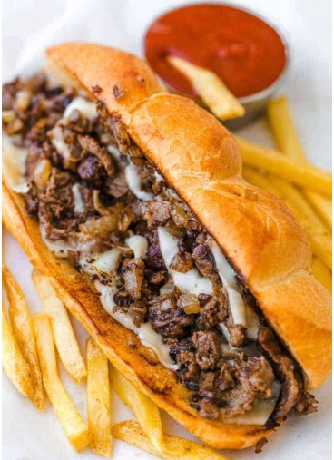

###### International services and great food
# [About](https://hawaiideveloper.github.io/nicalista/about/) **-** [Menu](https://hawaiideveloper.github.io/nicalista/menu/) **-** [Services](https://hawaiideveloper.github.io/nicalista/services/) **-** [Careers](https://hawaiideveloper.github.io/nicalista/careers/)

# Menu

## Foods

<table>
 <tr>
    <td>brochetas</td>
    <td></td>
    <td>a Delicious Brochetas:</td>
    <td>Precio en Cordobas</td>
  </tr>
</table>

<table>
<tr>
    <td>Chaulupa:</td>
    <td></td>
    <td>a Delicious chalupa:</td>
    <td>Precio en Cordobas</td>
  </tr>
</table>

<table>
<tr>
    <td>Empanadas:</td>
    <td></td>
    <td>a Delicious Empanadas::</td>
    <td>Precio en Cordobas</td>
  </tr>
</table>

<table>
<tr>
    <td>Philly Cheese Steak:  </td>
    <td> </td>
    <td>a Delicious Philly Cheese Steak:  </td>
    <td>Precio en Cordobas</td>
  </tr>
</table>
  
<table>
<tr>
    <td>Pupusas:</td>
    <td> </td>
    <td>a Delicious Philly Cheese Steak:  </td>
    <td>Precio en Cordobas</td>
  </tr>
</table>

<table>
<tr>
    <td>Quesadillas:  </td>
    <td>< </td>
    <td>a Delicious Quesadillas: </td>
    <td>Precio en Cordobas</td>
  </tr>
</table>
 

 
---  
## Drinks

Frappuccino:

Juice:

Smoothies:

### Productos (NicaLista)
  <table>
  <tr>
    <td>Todos los batidos naturales</td>
    <td>Batido de sabores naturales </td>
    <td>Precio en Dollars</td>
    <td>Precio en Cordobas</td>
  </tr>
  <tr>
    <td>Batido de fresa</td>
    <td> Fresas, trituradas, con hielo agregado y otros sabores naturales </td>
    <td>$2.00</td>
    <td>C$70.00</td>
  </tr>
  <tr>
    <td>Batido de mango</td>
    <td> Mangos, triturados, con hielo y sabores </td>
    <td>$2.00</td>
    <td>C$70.00 </td>
  </tr>
  <tr>
    <td>Batido de fresa / plátano</td>
    <td> Fresa / Plátano, triturada, con hielo y sabores </td>
    <td>$2.00</td>
    <td>C$70.00</td>
  </tr>
     <tr>
    <td>Frambuesa </td>
    <td> Frambuesa, triturada, hielo añadido y sabores. </td>
    <td>$2.00</td>
    <td>C$70.00</td>
  </tr>
  <tr>
    <td>Agua filtrada con hielo</td>
    <td>taza pequeña de 5 córdobas</td>
    <td>taza mediana 7 córdobas</td>
  
  </tr>
</table>

  <table>
  <tr>
    <td>Platos</td>
    <td>Comidas rapidas</td>
    <td>Precio in Dollars</td>
    <td>Precio in Cordobas</td>
  </tr>
  <tr>
    <td>Sándwich de hamburguesa de ternera con salsas y otros aderezos a elegir</td>
    <td> Hamburguesa de 1/8 de libra</td>
    <td>$2.00</td>
    <td>C$70.00</td>
  </tr>
   <tr>
    <td>Sándwich de hamburguesa con queso y carne con diferentes aderezos y salsas.</td>
    <td>Queso en una hamburguesa de 1/8 de libra</td>
    <td>$3.00</td>
    <td>C$100.00</td>
  </tr>
     <td>Double Bacon Cheeseburger or 1/4 pound Beef Sandwhich</td>
    <td>Queso en una hamburguesa de 2 1/8 libras o 1/4 de carne de res con la elección de salsas o aderezos</td>
    <td>$5.00</td>
    <td>$170.00</td>
  </tr>
  <tr>
    <td>Bandejas de mariscos</td>
    <td>Pescado frito pargo rojo</td>
    <td>$8.00</td>
    <td>C$290.00</td>
  </tr>
  <tr>
    <td>Bandejas de pollo</td>
    <td>sándwich de pollo</td>
    <td>$8.00</td>  
    <td>C$290</td>   
  </tr>
     <tr>
    <td>Platos vegetarianos</td>
    <td>Ensalada</td>
    <td>$4.00</td>
    <td>C$140</td>
  </tr>
  <tr>
    <td>Bandejas de cerdo</td>
    <td>Costillas de cerdo</td>
    <td>$8.00</td>
    <td>C$290</td>
  </tr>
</table>
  
  
   <table>
  <tr>
    <td>Bebidas</td>
    <td>Soda</td>
    <td>Precio</td>

  </tr>
  <tr>
    <td>Coca-Cola</td>
    <td>pequeño Vaso 18</td>
    <td>large Vaso 34</td>
  </tr>
  <tr>
    <td>Sprite</td>
    <td>pequeño Vaso 18</td>
    <td>large Vaso 34</td>
  </tr>
  <tr>
    <td>Pepsi</td>
    <td>pequeño Vaso</td>
    <td>large Vaso</td>
  </tr>
     <tr>
    <td>Limonada</td>
    <td>pequeño Vaso</td>
    <td>large Vaso</td>
  </tr>
  <tr>
    <td>Jugo artificial</td>
    <td>sm Vaso</td>
    <td>large Vaso</td>
  </tr>
</table>

  <h2> Estado de la misión: </h2>
 
 
  
 <h6> 

Tratando de unir al mundo para que todos, a los ojos de DIOS, puedan ver la belleza de comerciar entre ellos.

</h6>
  
  

